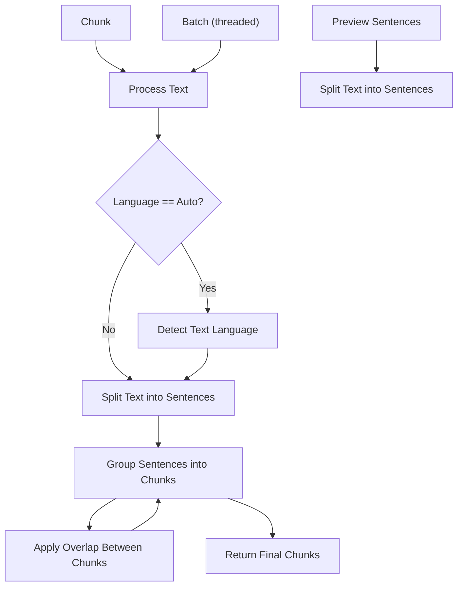

# 📦 Chunklet: Smart Multilingual Text Chunker


[](https://www.python.org/downloads/)
[](https://pypi.org/project/chunklet)
[](https://github.com/Speedyk-005/chunklet)
[](https://opensource.org/licenses/MIT)

> Chunk smarter, not harder — built for LLMs, RAG pipelines, and beyond.  
**Author:** speedyk_005  
**Version:** 1.1.0  
**License:** MIT


## 📌 What’s New in v1.1.0
- 🔄 **Primary sentence splitter replaced:** Replaced `sentsplit` with `pysbd` for improved sentence boundary detection.
- ⚡ **Language Detection Upgrade:** Migrated from `langid` to `py3langid`, delivering identical accuracy but ~40× faster classification speeds in benchmarks, significantly reducing multilingual processing latency.
- 🧵 **Parallel Processing Optimization:** Replaced `mpire.WorkerPool` with Python’s built-in `concurrent.futures.ThreadPoolExecutor` for lower overhead and improved performance on small to medium-sized batches.
- 🔧 **Multiple Refactor Steps:** Core code reorganized for clarity, maintainability, and performance.

---

## 🔥 Why Chunklet?

Feature                  | Why it’s elite  
------------------------|----------------
⛓️ **Hybrid Mode**          | Combines token + sentence limits with guaranteed overlap — rare even in commercial stacks.  
🌐 **Multilingual Fallbacks** | Pysbd > SentenceSplitter > Regex, with dynamic confidence detection.  
➿ **Clause-Level Overlap**   | `overlap_percent` now operates at the **clause level**, preserving semantic flow across chunks using `, ; …` logic.  
⚡ **Parallel Batch Processing** | Efficient parallel processing with `ThreadPoolExecutor`, optimized for low overhead on small batches.  
♻️ **LRU Caching**            | Smart memoization via `functools.lru_cache`.  
🪄 **Pluggable Token Counters** | Swap in GPT-2, BPE, or your own tokenizer.

---

## 🧩 Chunking Modes

Pick your flavor:

- `"sentence"` — chunk by sentence count only  
- `"token"` — chunk by token count only  
- `"hybrid"` — sentence + token thresholds respected with guaranteed overlap  

---

## 🌍 Language Support (36+)

- **Primary (Pysbd):** Supports a wide range of languages for highly accurate sentence boundary detection.
  (e.g., ar, pl, ja, da, zh, hy, my, ur, fr, it, fa, bg, el, mr, ru, nl, es, am, kk, en, hi, de)
- **Secondary (SentenceSplitter):** Provides support for additional languages not covered by Pysbd.
  (e.g., pt, no, cs, sk, lv, ro, ca, sl, sv, fi, lt, tr, hu, is)
- **Fallback (Smart Regex):** For any language not explicitly supported by the above, a smart regex-based splitter is used as a reliable fallback.

---

## 🌊 Internal Workflow

Here's a high-level overview of Chunklet's internal processing flow:



---

## 📦 Installation

Install `chunklet` easily from PyPI:

```bash
pip install chunklet
```

To install from source for development:

```bash
git clone https://github.com/Speedyk-005/chunklet.git
cd chunklet
pip install -e .
```

---

## ✨ Getting started

Get started with `chunklet` in just a few lines of code. Here’s a basic example of how to chunk a text by sentences:

```python
from chunklet import Chunklet

# Sample text
text = (
    "She loves cooking. He studies AI. The weather is great. "
    "We play chess. Books are fun. Robots are learning."
)

# Initialize Chunklet 
chunker = Chunklet(verbose=False, use_cache=True) # Note: this are by default

# 1. Preview the sentences
sentences = chunker.preview_sentences(text)
print("Sentences to be chunked:")
for s in sentences:
    print(f"- {s}")

# 2. Chunk the text by sentences
chunks = chunker.chunk(
    text,
    mode="hybrid",
    max_sentences=2,
    overlap_percent=20
)

# Print the chunks
print("\nChunks:")
for i, chunk in enumerate(chunks):
    print(f"--- Chunk {i+1} \")
    print(chunk)
```

This will output:

```
Sentences to be chunked:
- She loves cooking.
- He studies AI.
- The weather is great.
- We play chess.
- Books are fun.
- Robots are learning.

Chunks:
--- Chunk 1 ---
She loves cooking.
He studies AI.
--- Chunk 2 ---
The weather is great.
We play chess.
--- Chunk 3 ---
Books are fun.
Robots are learning.
```


### Advanced Usage

#### Custom Token Counter

This example shows how to use a custom function to count tokens, which is essential for token-based chunking.

<details>
<summary>Click to see Custom Token Counter Example</summary>

```python
from chunklet import Chunklet

# Define a custom token counter
def simple_token_counter(text: str) -> int:
    return len(text.split())

# Initialize Chunklet with the custom counter (this will be the default for the instance)
chunker = Chunklet(token_counter=simple_token_counter)

text = "This is a sample text to demonstrate custom token counting."

print("--- Using token_counter from Chunklet initialization ---")
# Chunk by tokens, using the token_counter set during Chunklet initialization
chunks_default = chunker.chunk(text, mode="token", max_tokens=5)
for i, chunk in enumerate(chunks_default):
    print(f"Chunk {i+1}: {chunk}")

print("\n--- Overriding token_counter in chunk method ---")
# Define another token counter for overriding
def another_token_counter(text: str) -> int:
    return len(text.replace(" ", "")) # Counts characters without spaces

# Chunk by tokens, overriding the token_counter for this specific call
chunks_override = chunker.chunk(text, mode="token", max_tokens=5, token_counter=another_token_counter)
for i, chunk in enumerate(chunks_override):
    print(f"Chunk {i+1}: {chunk}")
```
</details>

#### Hybrid Mode with Overlap

Combine sentence and token limits with overlap to maintain context between chunks.

<details>
<summary>Click to see Hybrid Mode with Overlap Example</summary>

```python
from chunklet import Chunklet

def simple_token_counter(text: str) -> int:
    return len(text.split())

chunker = Chunklet(token_counter=simple_token_counter)

text = (
    "This is a long text to demonstrate hybrid chunking. "
    "It combines both sentence and token limits for flexible chunking. "
    "Overlap helps maintain context between chunks by repeating some clauses."
)

# Chunk with both sentence and token limits, and 20% overlap
chunks = chunker.chunk(
    text,
    mode="hybrid",
    max_sentences=2,
    max_tokens=15,
    overlap_percent=20
)

for i, chunk in enumerate(chunks):
    print(f"--- Chunk {i+1} ---")
    print(chunk)
```
</details>

#### Batch Processing

Process multiple documents in parallel for improved performance.

<details>
<summary>Click to see Batch Processing Example</summary>

```python
from chunklet import Chunklet

texts = [
    "First document. It has two sentences.",
    "Second document. This one is slightly longer.",
    "Third document. A final one to make a batch.",
]

chunker = Chunklet()

# Process texts in parallel
results = chunker.batch_chunk(texts, mode="sentence", max_sentences=1, n_jobs=2)

for i, doc_chunks in enumerate(results):
    print(f"--- Document {i+1} ---")
    for j, chunk in enumerate(doc_chunks):
        print(f"Chunk {j+1}: {chunk}")
```
</details>


## 📊 Benchmarks

Performance metrics for various chunking modes and language processing.

### Chunk Modes

| Mode     | Avg. time (s) |
|----------|----------|
| sentence | 0.0173   |
| token    | 0.0177   |
| hybrid   | 0.0179   |

### Batch Chunking

| Metric                   | Value   |
|--------------------------|---------|
| Iterations               | 256     |
| Number of texts          | 3       |
| Total text length (chars)| 81175   |
| Avg. time (s)                 | 0.1846  |

For detailed benchmark implementation, refer to the [`bench.py`](https://github.com/speedyk-005/chunklet/blob/main/bench.py) script.

---

## 🧪 Planned Features

- [x] CLI interface with --file, --mode, --overlap, etc.
- [ ] Named chunking presets (conceptually "all", "random_gap") for downstream control 
- [ ] code splitting based on interest point
- [ ] PDF splitter with metadata

---

## 💡Projects that inspire me

| Tool                      | Description                                                                                      |
|---------------------------|--------------------------------------------------------------------------------------------------|
| [**Semchunk**](https://github.com/cocktailpeanut/semchunk)  | Semantic-aware chunking using transformer embeddings.                  |
| [**CintraAI Code Chunker**](https://github.com/CintraAI/code-chunker) | AST-based code chunker for intelligent code splitting.                 |


---

## 🤝 Contributing

1. Fork this repo
2. Create a new feature branch
3. Code like a star
4. Submit a pull request

-----

## 📜 Changelog

See the [CHANGELOG.md](https://github.com/speedyk-005/chunklet/blob/main/CHANGELOG.md) for a history of changes.

---

📜 License

> MIT License. Use freely, modify boldly, and credit the legend (me. Just kidding!)
