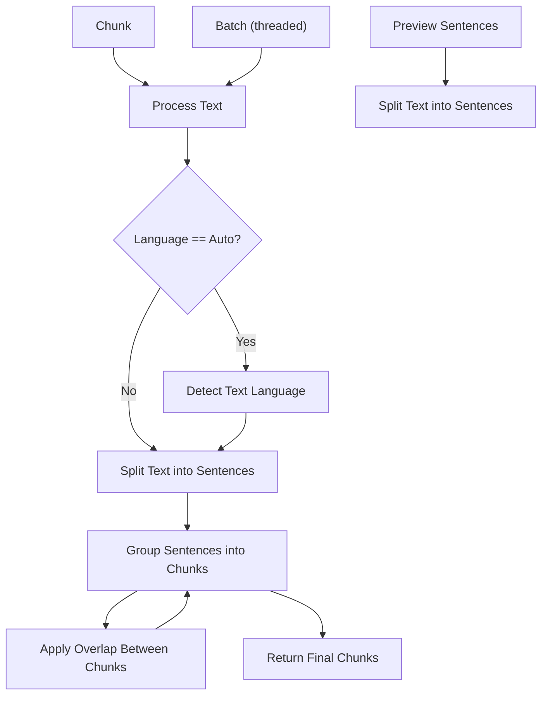

# 🧩 Chunklet: Multi_strategy, Context-aware, Multilingual Text Chunker


[](https://www.python.org/downloads/)
[](https://pypi.org/project/chunklet)
[](https://github.com/Speedyk-005/chunklet)
[](https://opensource.org/licenses/MIT)
[](https://github.com/speedyk-005/chunklet/actions)

> Chunk smarter, not harder — built for LLMs, RAG pipelines, and beyond.  
**Author:** speedyk_005  
**Version:** 1.3.1
**License:** MIT

## Table of Contents
- [What’s New in v1.3.x](#-whats-new-in-v13x)
- [Why Chunklet?](#-why-chunklet)
- [Benchmarks](#-benchmarks)
- [Chunking Modes](#-chunking-modes)
- [Language Support (36+)](#-language-support-36)
- [Internal Workflow](#-internal-workflow)
- [Installation](#-installation)
- [Getting started](#-getting-started)
- [Advanced Usage](#advanced-usage)
  - [Custom Token Counter](#custom-token-counter)
  - [Hybrid Mode with Overlap](#hybrid-mode-with-overlap)
  - [Batch Processing](#batch-processing)
  - [Custom Sentence Splitter](#custom-sentence-splitter)
- [CLI Usage](#-cli-usage)
  - [Basic Chunking](#basic-chunking)
  - [Chunking from a File](#chunking-from-a-file)
  - [Specifying Chunking Mode and Parameters](#specifying-chunking-mode-and-parameters)
  - [Using a Custom Tokenizer Command](#using-a-custom-tokenizer-command)
  - [Batch Processing from a File](#batch-processing-from-a-file)
- [Planned Features](#-planned-features)
- [Projects that inspire me](#-projects-that-inspire-me)
- [Contributing](#-contributing)
- [Changelog](#-changelog)
- [License](#license)

---

## 📌 What’s New in v1.3.x

- 🐛 **Critical Bug Fixes**: Addressed an `IndexError` in overlap calculation and other bugs.
- ✂️ **Custom Sentence Splitters**: Added support for integrating custom sentence splitting functions, allowing users to define their own logic for specific languages or requirements.
- ⚡ **Faster batching**: On `n_jobs=1`, mpire is not used to prevent overheads. on `n_jobs>=2` batch are process with group of 2 per process. 
- 💡 **Improved Fallback Splitter**: Used `\p{Lu}`, `\p{Ll}` in `regex_splitter.py` to identify and handle abbreviations and acronyms more accurately across different languages.
- 🌐 **Robust fallback splitter:** Switched to a simpler, more robust and predictable sentence splitter as fallback. Reduced over splitting and merging.
- 📊 **Progress Bar for Batch Processing**: Get visual feedback on the progress of your batch chunking jobs with a `rich` progress bar.
- 🚧 **Fault-Tolerant Batch Processing**: In batch mode, if a task fails, `chunklet` will now stop processing and return the results of the tasks that completed successfully, preventing wasted work.
- ✨ **Improved Overlap Logic**: Refined the `_get_overlap_clauses` function for simpler, more robust clause handling and capitalization checks.
- 🔢 **Token Counter Error Handling**: Enhanced robustness by introducing a helper method to safely count tokens and handle potential errors from user-provided token counters. On error, operation is aborted.
- 🚀 **LRU Cache Optimization**: Increased `lru_cache` maxsize from 25 to 256 for improved caching performance.
- 🚨 **Robust Error Handling**: Introduced custom exception types (`ChunkletError`, `InvalidInputError`, `TokenNotProvidedError`) for clearer and more specific error reporting, improving debugging and application stability.
- 🔍 **`preview_sentences` Enhanced Output**: The `preview_sentences` function now returns a tuple containing the list of sentences and any warnings encountered during processing, allowing for better insight into potential issues.

## 🤔 Why Chunklet?

Feature                  | Why it’s elite  
------------------------|----------------
⛓️ **Hybrid Mode**          | Combines token + sentence limits with guaranteed overlap — rare even in commercial stacks.  
🌐 **Multilingual Fallbacks** | Pysbd > SentenceSplitter > Regex, with dynamic confidence detection.  
➿ **Clause-Level Overlap**   | `overlap_percent operates at the **clause level**, preserving semantic flow across chunks using logic.  
⚡ **Parallel Batch Processing** | Efficient parallel processing with `ThreadPoolExecutor`, optimized for low overhead on small batches.  
♻️ **LRU Caching**            | Smart memoization via `functools.lru_cache`.  
🪄 **Pluggable Token Counters** | Swap in GPT-2, BPE, or your own tokenizer.
✂️ **Pluggable Sentence splitters**  | Integrate custom splitters for more specific languages.

---

## 🧩 Chunking Modes

Pick your flavor:

- `"sentence"` — chunk by sentence count only # the minimum `max_sentences` is 1.
- `"token"` — chunk by token count only # The minimum `max_tokens` is 10
- `"hybrid"` — sentence + token thresholds respected with guaranteed overlap. Internally, the system estimates a residual capacity of 0-2 typical clauses per sentence to manage chunk boundaries effectively.  

---

## 🌍 Language Support (36+)

- **Primary (Pysbd):** Supports a wide range of languages for highly accurate sentence boundary detection.
  (e.g., ar, pl, ja, da, zh, hy, my, ur, fr, it, fa, bg, el, mr, ru, nl, es, am, kk, en, hi, de)
  For more information: [PyPI](https://pypi.org/project/pysbd/) 
- **Secondary (sentence_splitter):** Provides support for additional languages not covered by Pysbd.
  For more information: [GitHub](https://github.com/mediacloud/sentence-splitter) 
  (e.g., pt, no, cs, sk, lv, ro, ca, sl, sv, fi, lt, tr, hu, is)
- **Fallback (Smart Regex):** For any language not explicitly supported by the above, a smart regex-based splitter is used as a reliable fallback.

---

## 🌊 Internal Workflow

Here's a high-level overview of Chunklet's internal processing flow:



---

## 📦 Installation

Install `chunklet` easily from PyPI:

```bash
pip install chunklet
```

To install from source for development:

```bash
git clone https://github.com/Speedyk-005/chunklet.git
cd chunklet
pip install -e .
```

---

## ✨ Getting started

Get started with `chunklet` in just a few lines of code. Here’s a basic example of how to chunk a text by sentences:

```python
from chunklet import Chunklet

# Sample text
text = (
    "She loves cooking. He studies AI. The weather is great. "
    "We play chess. Books are fun. Robots are learning."
)

# Initialize Chunklet 
chunker = Chunklet(verbose=False, use_cache=True) # Note: this are by default

# 1. Preview the sentences
# Returns a tuple of sentences and warnings if any
sentences, _ = chunker.preview_sentences(text)
print("Sentences to be chunked:")
for s in sentences:
    print(f"- {s}")

# 2. Chunk the text by sentences
chunks = chunker.chunk(
    text,
    mode="hybrid",
    max_sentences=2,
    overlap_percent=20
)

# Print the chunks
print("\nChunks:")
for i, chunk in enumerate(chunks):
    print(f"--- Chunk {i+1} \")
    print(chunk)
```

### Advanced Usage

#### Custom Token Counter

This example shows how to use a custom function to count tokens, which is essential for token-based chunking.

<details>
<summary>Click to see Custom Token Counter Example</summary>

```python
from chunklet import Chunklet

# Define a custom token counter
def simple_token_counter(text: str) -> int:
    return len(text.split())

# Initialize Chunklet with the custom counter (this will be the default for the instance)
chunker = Chunklet(token_counter=simple_token_counter)

text = "This is a sample text to demonstrate custom token counting."

print("--- Using token_counter from Chunklet initialization ---")
# Chunk by tokens, using the token_counter set during Chunklet initialization
chunks_default = chunker.chunk(text, mode="token", max_tokens=5)
for i, chunk in enumerate(chunks_default):
    print(f"Chunk {i+1}: {chunk}")

print("\n--- Overriding token_counter in chunk method ---")
# Define another token counter for overriding
def another_token_counter(text: str) -> int:
    return len(text.replace(" ", "")) # Counts characters without spaces

# Chunk by tokens, overriding the token_counter for this specific call
chunks_override = chunker.chunk(text, mode="token", max_tokens=5, token_counter=another_token_counter)
for i, chunk in enumerate(chunks_override):
    print(f"Chunk {i+1}: {chunk}")
```
</details>

#### Hybrid Mode with Overlap

Combine sentence and token limits with overlap to maintain context between chunks.

<details>
<summary>Click to see Hybrid Mode with Overlap Example</summary>

```python
from chunklet import Chunklet

def simple_token_counter(text: str) -> int:
    return len(text.split())

chunker = Chunklet(token_counter=simple_token_counter)

text = (
    "This is a long text to demonstrate hybrid chunking. "
    "It combines both sentence and token limits for flexible chunking. "
    "Overlap helps maintain context between chunks by repeating some clauses."
)

# Chunk with both sentence and token limits, and 20% overlap
chunks = chunker.chunk(
    text,
    mode="hybrid",
    max_sentences=2,
    max_tokens=15,
    overlap_percent=20
)

for i, chunk in enumerate(chunks):
    print(f"--- Chunk {i+1} ---")
    print(chunk)
```
</details>

#### Batch Processing

Process multiple documents in parallel for improved performance.

<details>
<summary>Click to see Batch Processing Example</summary>

```python
from chunklet import Chunklet

texts = [
    "First document. It has two sentences.",
    "Second document. This one is slightly longer.",
    "Third document. A final one to make a batch.",
]

chunker = Chunklet()

# Process texts in parallel
results = chunker.batch_chunk(texts, mode="sentence", max_sentences=1, n_jobs=2)

for i, doc_chunks in enumerate(results):
    print(f"--- Document {i+1} ---")
    for j, chunk in enumerate(doc_chunks):
        print(f"Chunk {j+1}: {chunk}")
```
</details>

#### Custom Sentence Splitter

You can provide your own custom sentence splitting functions to Chunklet. This is useful if you have a specialized splitter for a particular language or domain that you want to prioritize over Chunklet's built-in splitters.

To use a custom splitter, initialize `Chunklet` with the `custom_splitters` parameter. This parameter expects a list of dictionaries, where each dictionary defines a splitter:

*   `name` (str): A unique name for your splitter.
*   `languages` (str or Iterable[str]): The language code(s) this splitter supports (e.g., "en", or ["fr", "es"]).
*   `callback` (Callable[[str], List[str]]): A function that takes the input text (string) and returns a list of sentences (list of strings).

Custom splitters are checked before Chunklet's default `pysbd` and `sentence-splitter` implementations. If multiple custom splitters support the same language, the first one in the provided list will be used.

<details>
<summary>Click to see Custom Sentence Splitter Example</summary>

```python
from chunklet import Chunklet
from typing import List

# Define a simple custom sentence splitter
def my_custom_splitter(text: str) -> List[str]:
    # This is a very basic splitter for demonstration
    # In a real scenario, this would be a more sophisticated function
    return [s.strip() for s in text.split(". ") if s.strip()]

# Initialize Chunklet with the custom splitter
chunker = Chunklet(
    custom_splitters=[
        {
            "name": "MyCustomEnglishSplitter",
            "languages": "en",
            "callback": my_custom_splitter,
        }
    ]
)

text = "This is the first sentence. This is the second sentence. And the third."
chunks = chunker.chunk(text, mode="sentence")

print("--- Chunks using Custom Splitter ---")
for i, chunk in enumerate(chunks):
    print(f"Chunk {i+1}: {chunk}")

# Example with a custom splitter for multiple languages
def multi_lang_splitter(text: str) -> List[str]:
    # A more complex splitter that might handle specific rules for French and Spanish
    return [s.strip() for s in text.split("! ") if s.strip()]

chunker_multi = Chunklet(
    custom_splitters=[
        {
            "name": "MultiLangExclamationSplitter",
            "languages": ["fr", "es"],
            "callback": multi_lang_splitter,
        }
    ]
)

text_fr = "Bonjour! Comment ça va! C'est super!"
chunks_fr = chunker_multi.chunk(text_fr, lang="fr", mode="sentence")
print("\n--- Chunks using Multi-language Custom Splitter (French) ---")
for i, chunk in enumerate(chunks_fr):
    print(f"Chunk {i+1}: {chunk}")

text_es = "Hola! Qué tal! Muy bien!"
chunks_es = chunker_multi.chunk(text_es, lang="es", mode="sentence")
print("\n--- Chunks using Multi-language Custom Splitter (Spanish) ---")
for i, chunk in enumerate(chunks_es):
    print(f"Chunk {i+1}: {chunk}")

```
</details>

---

## 🚀 CLI Usage

Chunklet provides a command-line interface for quick and easy text chunking.

<details>
<summary>Click to see examples</summary>
### Basic Chunking

Chunk a single text directly from the command line:

```bash
chunklet "She loves cooking. He studies AI. The weather is great."
```

### Chunking from a File

Chunk text from an input file and optionally save the output to another file:

```bash
# Chunk from input.txt and print to console
chunklet --file input.txt

# Chunk from input.txt and save to output.txt
chunklet --file input.txt --output-file output.txt
```

### Specifying Chunking Mode and Parameters

Control how text is chunked using various arguments:

```bash
# Chunk by sentences, with a maximum of 3 sentences per chunk
chunklet "Your long text here..." --mode sentence --max-sentences 3

# Chunk by tokens, with a maximum of 50 tokens per chunk and 10% overlap
chunklet "Your long text here..." --mode token --max-tokens 50 --overlap-percent 10

# Chunk in hybrid mode, with specific language and offset
chunklet "Tu texto largo aquí..." --mode hybrid --lang es --max-sentences 5 --max-tokens 100 --offset 1
```

### Using a Custom Tokenizer Command

For token-based modes, you can provide an external shell command to count tokens. The command should accept text via stdin and output the token count as a number to stdout.

#### Basic Example: Word Count

A simple approach is to use `wc -w` to count words, which can be a rough approximation for tokens.

```bash
# Example using 'wc -w' as a simple word counter (approximation of tokens)
chunklet "This is a sample text for token counting." --mode token --max-tokens 5 --tokenizer-command "wc -w"
```

#### Advanced Example: Using `tiktoken`

For more accurate tokenization that matches OpenAI's models, you can use the `tiktoken` library.

1.  **Install `tiktoken`:**
    ```bash
    pip install tiktoken
    ```

2.  **Create a tokenizer script (`my_tokenizer.py`):**
    ```python
    # my_tokenizer.py
    import tiktoken
    import sys

    def count_tokens(text):
        # Using cl100k_base encoding, suitable for gpt-3.5-turbo and gpt-4
        encoding = tiktoken.get_encoding("cl100k_base")
        return len(encoding.encode(text))

    if __name__ == "__main__":
        input_text = sys.stdin.read()
        token_count = count_tokens(input_text)
        print(token_count)
    ```

3.  **Use the script with `chunklet`:**
    You'll need to use the python from your virtual environment if you are using one.
    ```bash
    chunklet "Your long text here..." --mode token --max-tokens 100 --tokenizer-command "python my_tokenizer.py"
    ```


### Batch Processing from a File

Process multiple texts in parallel from a file where each line is a separate text.

```bash
# Assuming 'batch_input.txt' contains one text per line:
# Text 1 line 1. Text 1 line 2.
# Text 2 line 1.
# Text 3 line 1. Text 3 line 2. Text 3 line 3.

chunklet --file batch_input.txt --batch --mode sentence --max-sentences 1 --n-jobs 4
```
</details>

---

## 📊 Benchmarks

See the [BENCHMARKS.md](https://github.com/speedyk-005/chunklet/blob/main/BENCHMARKS.md) for detailed performance benchmarks, and the [benchmark script](https://github.com/speedyk-005/chunklet/blob/main/benchmark.py) for the code used to generate them.

---

## 🧪 Planned Features

- [x] CLI interface with --file, --mode, --overlap, etc.
- [ ] code splitting based on interest point
- [ ] PDF splitter with metadata

---

## 💡Projects that inspired me

| Tool                      | Description                                                                                      |
|---------------------------|--------------------------------------------------------------------------------------------------|
| [**Semchunk**](https://github.com/cocktailpeanut/semchunk)  | Semantic-aware chunking using transformer embeddings.                  |
| [**CintraAI Code Chunker**](https://github.com/CintraAI/code-chunker) | AST-based code chunker for intelligent code splitting.                 |
| [**semantic-chunker**](https://github.com/Goldziher/semantic-chunker) | A strongly-typed semantic text chunking library that intelligently splits content while preserving structure and meaning.                |


---

## 🤝 Contributing

1. Fork this repo
2. Create a new feature branch
3. Code like a star
4. Submit a pull request

-----

## 📜 Changelog

See the [CHANGELOG.md](https://github.com/speedyk-005/chunklet/blob/main/CHANGELOG.md) for a history of changes.

---

📜 License

> MIT License. Use freely, modify boldly, and credit the legend (me. Just kidding!)
